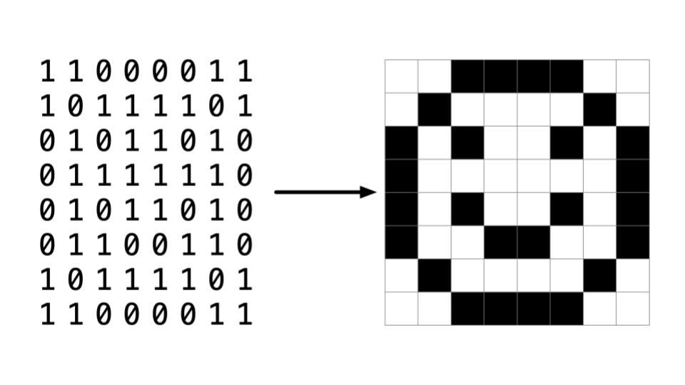
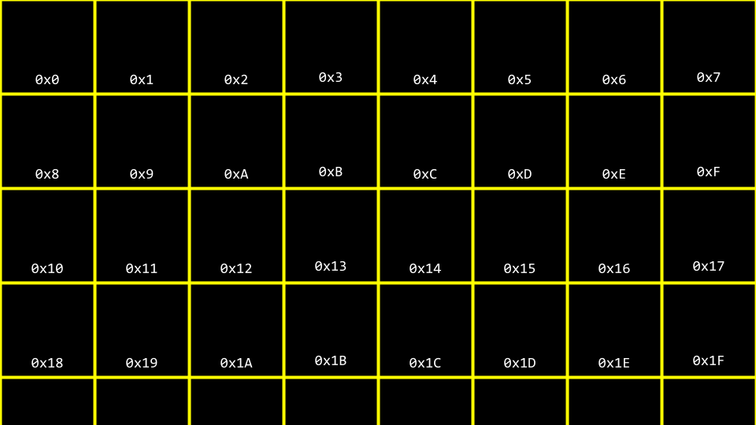
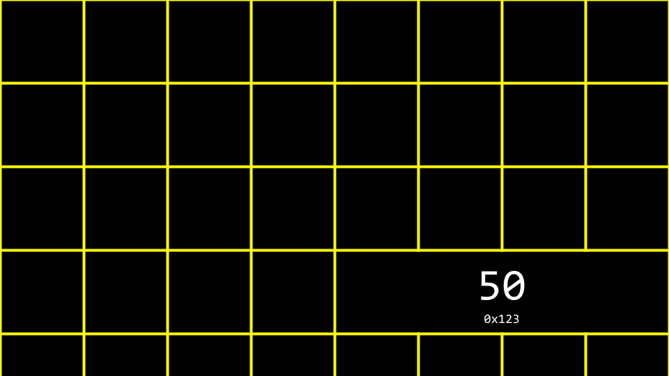
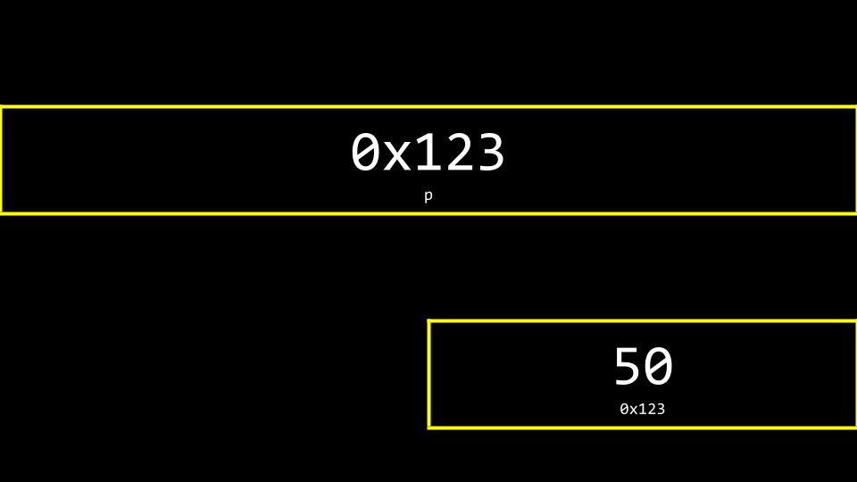
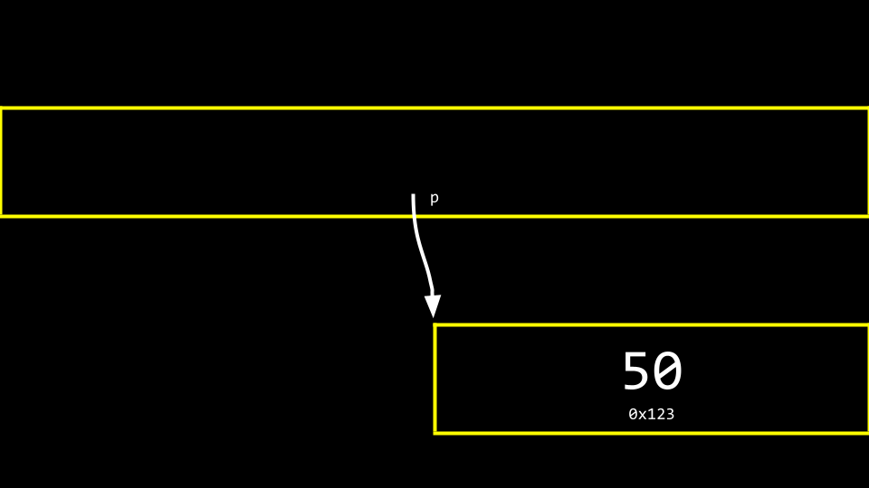
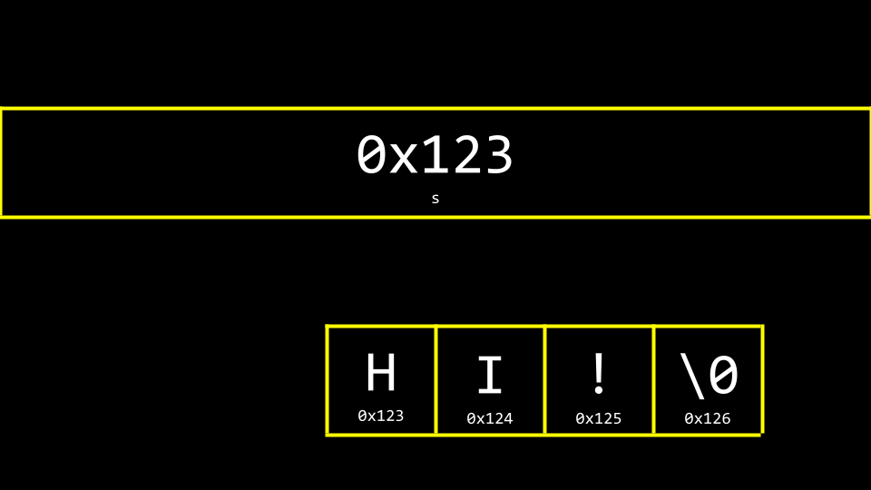
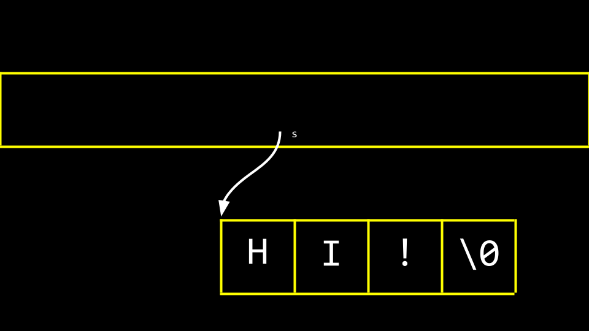
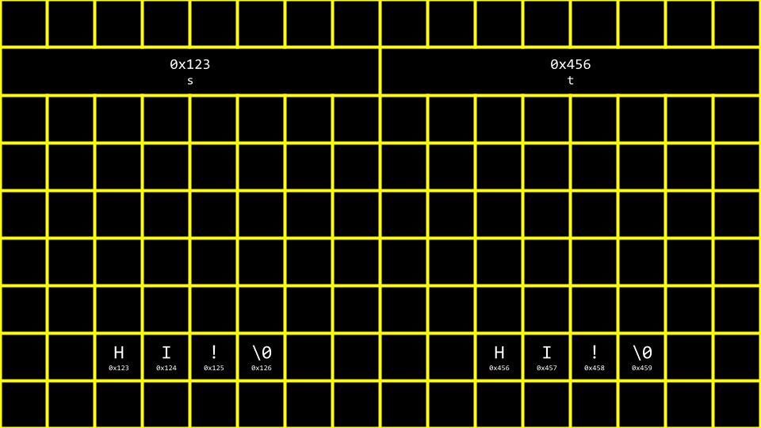
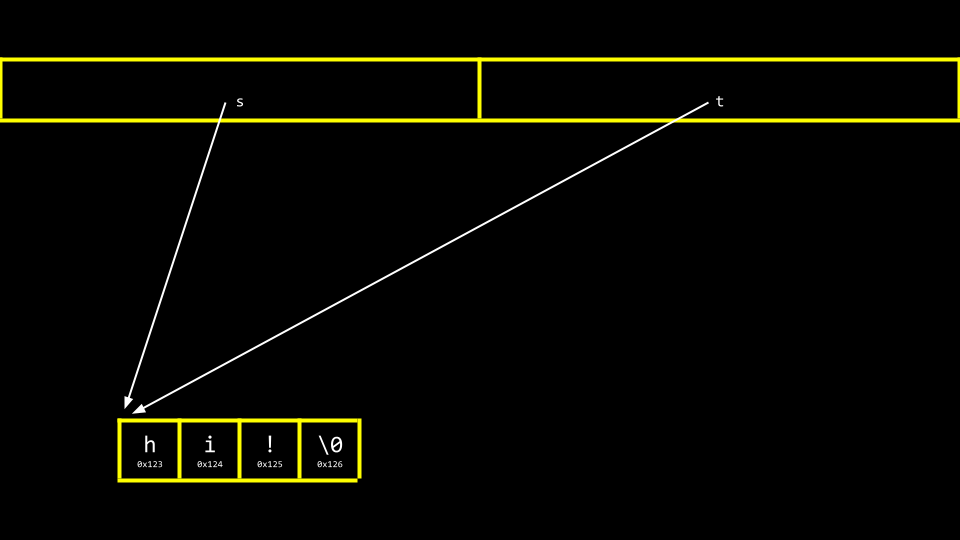

# Week 4

Essa semana é sobre memória 🧠 — como ela funciona dentro do computador e como a linguagem C nos permite manipular diretamente seus blocos. O foco está em ponteiros, arrays, strings e a forma como os dados são armazenados.

## Pixel Art
--- 


> uma imagem seria como um mapa de bits, onde zeros representam preto e uns representam branco.

Endereços de Memória
--- 

Cada variável no computador ocupa um espaço na memória. Esse espaço possui um endereço, que pode ser acessado e manipulado.



```
int n = 50;
printf("%p\n", &n); // imprime o endereço de memória de n
```




## Ponteiros

Um ponteiro é uma variável que armazena o endereço de outra variável.  
O operador `*` é usado para **acessar o valor** do endereço.

```c
int n = 50;
int *p = &n;        // a variável p é um ponteiro que armazena o endereço de n
printf("%i\n", *p); // imprime 50 porque esta apontando para o endereço de memoria n que recebeu o valor de 50
```

- `&` → pega o endereço.  
- `*` → acessa o valor armazenado nesse endereço.  

### Visualização do que aconteceu no codigo 



## Strings

Strings em C são, na verdade, **arrays de caracteres** terminados com `\0`.

```c
string s = "HI!";
printf("%c %c %c\n", s[0], s[1], s[2]); // H I !
```



### Ponteiros em strings
Strings são essencialmente ponteiros para o primeiro caractere da sequência.  
```c
char *s = "HI!";
printf("%p\n", s);    // endereço de memória
printf("%p\n", &s[0]); // mesmo endereço
```



[Exemplo de manipulação de string](string0.c)

## Comparando Strings

Um erro comum é usar `==` em strings. Isso só compara **endereços**, não os conteúdos.  

```c
if (s == t) // errado
```

Para comparar corretamente, usamos `strcmp`:
```c
if (strcmp(s, t) == 0)
{
    printf("Strings iguais\n");
}
```



[Exemplo de comparação](string1.c)

## Copiando Strings

Ao copiar strings, precisamos alocar memória para evitar sobrescrever dados.

```c
char *s = "HI!";
char *t = malloc(strlen(s) + 1);
strcpy(t, s);
```



[Exemplo de cópia](copy.c)

## Memória e Erros Comuns

- **Segmentation Fault**: tentar acessar memória inválida.  
- **Memory Leak**: esquecer de liberar memória alocada com `malloc`.  

```c
free(t);
```

## Valgrind

Ferramenta para detectar vazamentos de memória.  
Exemplo de uso no terminal:
```
valgrind ./programa
```

---

## Garbage Values

Variáveis não inicializadas podem conter valores aleatórios da memória.  

```c
int x;
printf("%i\n", x); // valor lixo
```

## Arquivos

Podemos trabalhar com arquivos usando ponteiros do tipo `FILE *`.  

```c
FILE *file = fopen("data.txt", "r");
if (file == NULL)
{
    return 1;
}
fclose(file);
```

## Filtros em Imagens

Exemplo clássico de manipulação de memória: edição de imagens.  
- **Bitmap** é uma matriz de pixels (cores representadas em RGB).  
- Podemos aplicar filtros percorrendo pixel por pixel e alterando valores.

[Implementando filtros em imagens](helpers.c)
                                
> Em resumo, essa semana é sobre entender **como os dados vivem dentro da memória** e aprender a trabalhar de forma segura com ponteiros, strings, arrays e arquivos. 
