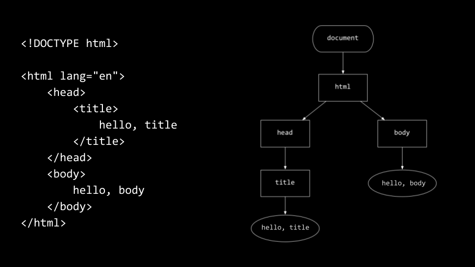

# Week 8

Semana dedicada a expandir nossos horizontes além do C, do Python e do SQL — entrando no mundo da Web com HTML, CSS e JavaScript. Aqui, vamos mergulhar no básico do funcionamento da internet e começar a construir interfaces interativas.

## A Internet e o Backend Teórico
- **Internet**: nasceu do ARPANET; os "pontos" entre dispositivos agem como **roteadores**.
- **DNS**: tradutor de endereços amigável (tipo “escola.com”) para IPs numéricos.
- **DHCP**: distribui IPs automaticamente — o zelador da rede.
- **HTTPS**: versão segura do HTTP (aquele "cadeadinho" que protege seus dados).
  
## HTML
- É a linguagem de marcação que dá **estrutura** à página.
- Usa **tags** e **atributos** para criar elementos como cabeçalhos, parágrafos, links, imagens e muito mais.

[Exemplo de utilizações do HTML](.md/html.md)

### Hierarquia das tags 




## CSS
- Faz o papel do stylist: cuida da **aparência**.
- Usa **seletores** para escolher elementos e aplicar **propriedades** de estilo (cores, fontes, margens etc.).
- E ainda pode contar com **frameworks** para facilitar e deixar tudo mais estiloso com menos trabalho.

[Exemplo de utilizações do CSS](.md/css.md)

## JavaScript
- Javascript é uma linguagem de tipagem dinâmica, ou seja que o tipo da variavel é determinado automaticamente com base no valor atribuido.
- Dá vida aos sites com **interatividade**.
- Conceitos principais:
  - **Variáveis**, **condicionais** e **loops**.
  - **Eventos** (como cliques e teclas).
  - DOM — o modelo de objeto do documento, é onde JS pode mexer nos elementos da página em tempo real.

[Exemplo de utilizações do JS](.md/js.md)

## Resumo Visual 
```
Internet (roteadores, DNS, HTTPS)
↓
HTML (estrutura)
↓
CSS (design)
↓
JavaScript (interatividade)
```

| Linguagem / Tema    | Comandos / Sintaxe Essencial                                                                                              |
| ------------------- | ------------------------------------------------------------------------------------------------------------------------- |
| **HTML**            | `<html>`, `<head>`, `<body>`, `<p>`, `<a>`, `<form>`, `<input>` com atributos, `http-server`                              |
| **CSS**             | `style="..."`, `<style>`, seletores: `.classe`, `#id`, propriedades: `font-size`, `text-align`; frameworks como Bootstrap |
| **JavaScript**      | `let var = ...;`, `<script>` inline ou externo, manipulação DOM e interatividade                                          |
| **HTTP / Internet** | `curl -I`, status codes, GET, DNS, HTTPS, roteadores e protocolos TCP/IP                                                  |

Com essa base, você começa a enxergar a Web como um playground, não apenas como uma tela estática. E olha, se a internet fosse um palco, HTML seria os cenários, CSS as luzes e figurinos, e o JavaScript o elenco animado que faz tudo acontecer.
