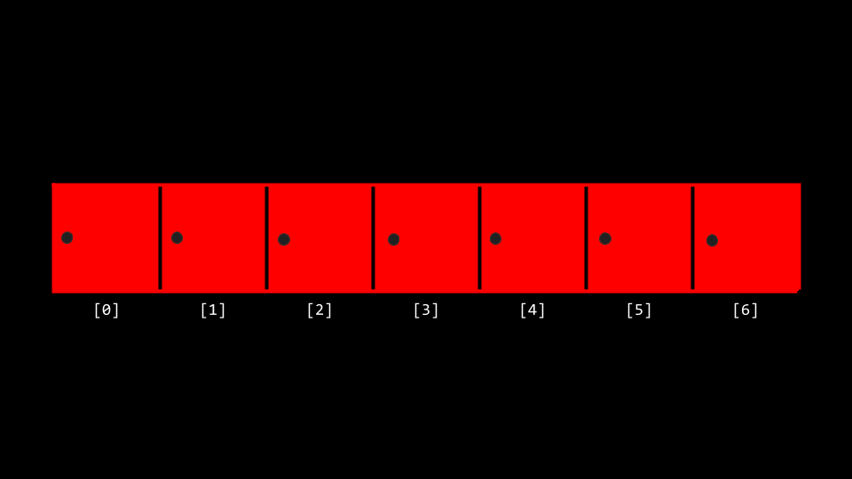
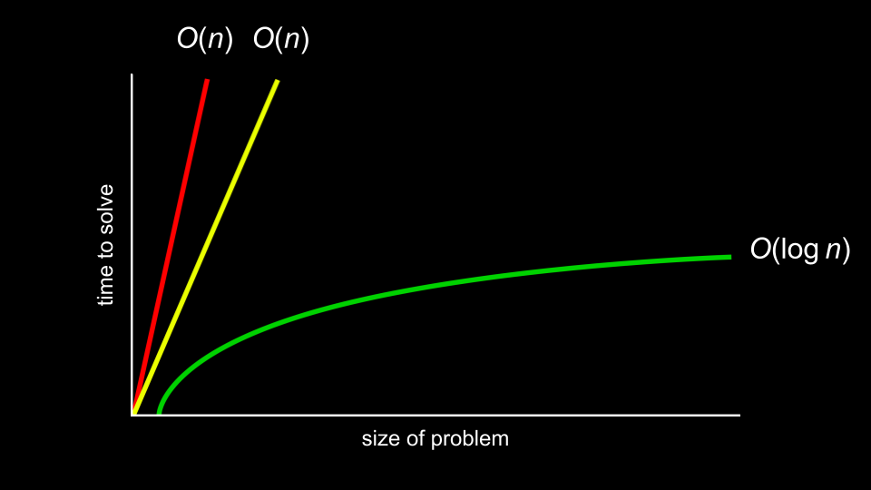

# Week 3

esse semana é realmente sobre dar uma pausa depois das ultimas duas de codigo C relativamente novo e intensivo e apenas resolves alguns problemas novos e mais sofisticados juntos

## Busca Linear


"O número 50 está dentro de um array?". Para resolver esse problemo o computador precisaria olhar para cada array para ver se o número 50 está lá dentro. 

Complexidade O(n) porque , no pior dos casos, seriam necessários n passos para ser executado.

Um exemplo de "codigo" dessa busca seria 
```
For i from 0 to n-1
    If 50 is behind doors[i]
        Return true
Return false
```
[se quiséssemos procurar um int dentro de um array](search0.c)

[se quiséssemos procurar uma string dentro de um array](search1.c)

[se quiséssemos combinar essas ideias de números e strings em um único programa](phonebook0.c)

## Busca Binária

 Outro algoritmo de busca que pode ser empregado em nossa tarefa de encontrar os 50. Esse algoritmo divia a busca 

Complexidade O(log n) porque seriam necessários cada vez menos passos para executá-lo, mesmo no pior dos casos.

```
Se não houver portas restantes
    Retorna falso
Se 50 estiver atrás da porta do meio
    Retorna verdadeiro
Caso contrário, se 50 < porta do meio
    Pesquisar metade esquerda
Caso contrário, se 50 > porta do meio
    Pesquisar metade direita
```

## Tempo de execução


## Estruturas 
E finalmente estruturas, em vez de codigos ineficiêncientes como esse abaixo. 
```
string names[] = {"Yuliia", "David", "John"};
string numbers[] = {"+1-617-495-1000", "+1-617-495-1000", "+1-949-468-2750"};
```
Nos podemos criar nossos próprios tipos de dados por meio de um struct.
```
typedef struct
{
    string name;
    string number;
} person;
```

[Implementando strucs](phonebook1.c)

> Observe que o código começa com typedef structo local onde um novo tipo de dado chamado personé definido. Dentro de a person há uma string chamada name e um string chamado number. No main, começa criando um array chamado people que é do tipo person que tem tamanho 3. Em seguida, atualizamos os nomes e números de telefone das duas pessoas em nosso people array. Mais importante ainda, observe como a notação de ponto , como people[0].name, nos permite acessar o personna posição 0 e atribuir um nome a esse indivíduo.

## Bubble Sort
Algoritmo de classificação que funciona trocando elementos repetidamente para “empilhar” elementos maiores até o final.
 
```
Repeat n-1 times
    For i from 0 to n–2
        If numbers[i] and numbers[i+1] out of order
            Swap them
    If no swaps
        Quit
```
## Recursão
Recursão é um conceito dentro da programação em que uma função chama a si mesma. 

```
Pick up phone book
Open to middle of phone book
Look at page
If person is on page
    Call person
Else if person is earlier in book
    Search left half of book
Else if person is later in book
    Search right half of book
Else
    Quit
```

[Implementando recursão no nosso codigo do mario da semana 1](recursion.c)

> Observe que o caso base garantirá que o código não seja executado para sempre. A linha if (n <= 0)encerra a recursão porque o problema foi resolvido. Toda vez que, drawchama a si mesma, ela se chama por n-1. Em algum momento, n-1será igual a 0, resultando no drawretorno da função e o programa será encerrado.

## Merge Sort
```
If only one number
    Quit
Else
    Sort left half of number
    Sort right half of number
    Merge sorted halves
```
