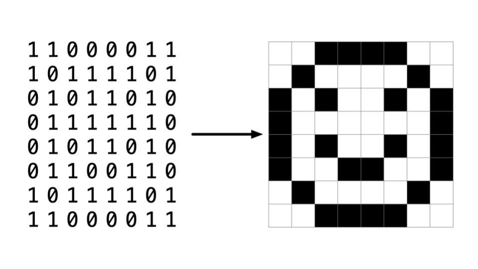
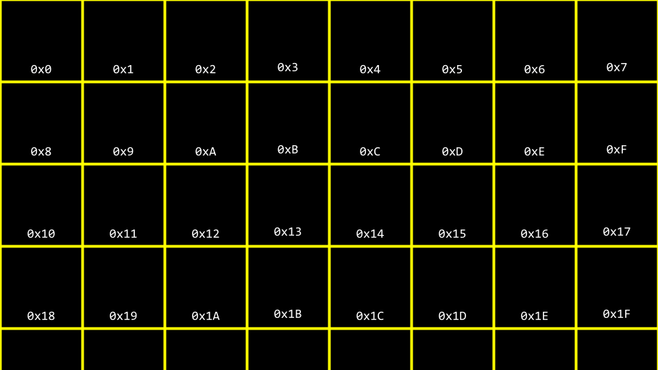
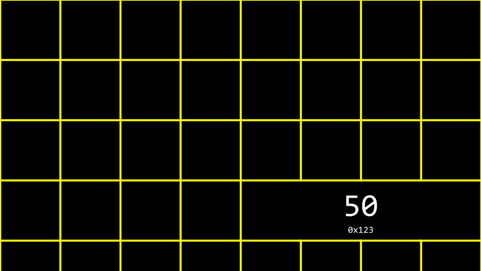

# Week 4

Essa semana é sobre memória 🧠 — como ela funciona dentro do computador e como a linguagem C nos permite manipular diretamente seus blocos. O foco está em ponteiros, arrays, strings e a forma como os dados são armazenados.

Pixel Art
--- 


> uma imagem seria como um mapa de bits, onde zeros representam preto e uns representam branco.

Endereços de Memória
--- 

Cada variável no computador ocupa um espaço na memória. Esse espaço possui um endereço, que pode ser acessado e manipulado.



```
int n = 50;
printf("%p\n", &n); // imprime o endereço de memória de n
```



Ponteiros
---

Um ponteiro é uma variável que armazena o endereço de outra variável.
O operador * é usado para acessar o valor do endereço.

```
int n = 50;
int *p = &n;
printf("%i\n", *p); // imprime 50
```

> & → pega o endereço.

> ' * → acessa o valor armazenado nesse endereço.